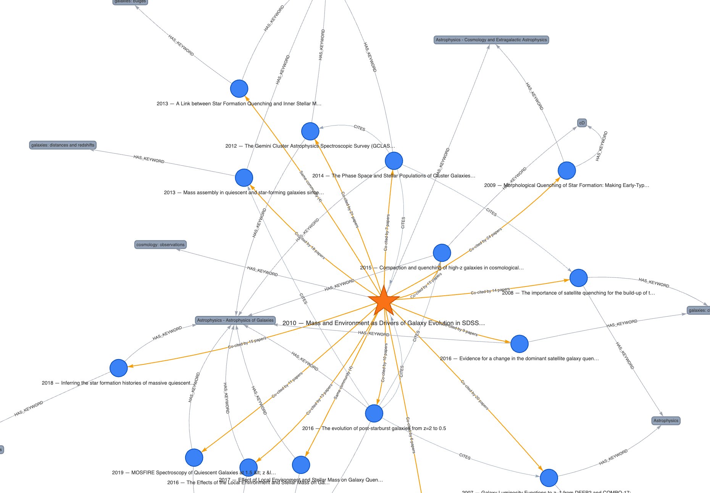
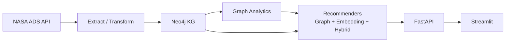

# ADS ScholarGraph

[](https://github.com/deepakdeo/ADS-ScholarGraph/actions/workflows/ci.yml?query=branch%3Amain)
[](https://www.python.org/downloads/release/python-3110/)
[](LICENSE)

ADS ScholarGraph is a local-first scientific literature discovery stack that ingests NASA ADS metadata, builds a Neo4j knowledge graph, computes graph analytics, and serves explainable hybrid recommendations through FastAPI + Streamlit.
Use it to pick a paper you are reading and instantly get a ranked “what to read next” list with transparent reasons (co-citation, shared community, and abstract similarity), plus an interactive KG view.

## Key Features

- Build and query a Neo4j knowledge graph of papers, authors, keywords, venues, and citation links.
- Explore paper influence and topic structure using PageRank and community detection outputs.
- Get explainable recommendations with graph signals, text similarity, and a hybrid ranker.
- Run the full stack locally with Docker Compose, FastAPI endpoints, and an interactive Streamlit UI.

## Demo Screenshots




## Visualization Features

- Interactive graph view with filters (year, citations, PageRank, community) and node search highlight.
- Shortest-path exploration between visible papers directly in the graph tab.
- Rich node tooltips with title, year, citations, PageRank, community, score, and reasons.
- Graph Stats tab with core KG metrics plus trends/distributions.
- Schema View tab with an auto-generated entity/relationship overview diagram.
- One-click graph exports from the UI: interactive HTML, GEXF (Gephi-ready), and static SVG snapshot.
- Sidebar similarity controls preview threshold/top-k settings used for `SIMILAR_TO` edge materialization.

## Architecture



## Quickstart (Local Demo)

This path assumes you already have processed data (example: `data/processed/quenching/`).

1. Create local environment file:
   ```bash
   cp .env.example .env
   ```
2. Set `NEO4J_PASSWORD` in `.env`.
3. Start services:
   Ensure Docker Desktop is running first.
   ```bash
   docker compose up --build
   ```
4. In a second terminal, install project tooling:
   ```bash
   python -m pip install --upgrade pip
   pip install -e ".[dev]"
   ```
5. Load the existing processed dataset into Neo4j:
   ```bash
   python -m ads_scholargraph.pipeline.load_neo4j \
     --indir data/processed/quenching \
     --wipe
   ```
6. Run graph analytics:
   ```bash
   python -m ads_scholargraph.graph_analytics.run_analytics --mode auto
   ```
7. Optional: materialize bounded similarity edges:
   ```bash
   python -m ads_scholargraph.graph_analytics.add_similarity_edges \
     --threshold 0.30 \
     --top-k 5 \
     --seed-only \
     --wipe-existing
   ```
8. Open apps:
- Streamlit: http://localhost:8501
- API docs: http://localhost:8000/docs
- Neo4j Browser: http://localhost:7474

Note: `ADS_API_TOKEN` is only required for data extraction/expansion. The API/UI demo runs from Neo4j-loaded data.

## Data Ingestion (Reproduce Dataset Locally)

`data/` is gitignored and not committed. Generate all datasets locally.

1. Set ADS token in `.env`:
   Create an ADS account at <https://ui.adsabs.harvard.edu/>, then open Settings -> API Token to generate your key.
   Keep this token local only (never commit it).
   ```env
   ADS_API_TOKEN=your_token_here
   ```
   ADS enforces API usage quotas; check your ADS settings/docs for your current daily limit.
2. Phase 1 extract raw ADS JSONL:
   ```bash
   python -m ads_scholargraph.pipeline.extract \
     --query "quenching" \
     --rows 200 \
     --max-results 2000 \
     --out data/raw/ads_quenching.jsonl
   ```
3. Phase 1 transform to normalized parquet tables:
   ```bash
   python -m ads_scholargraph.pipeline.transform \
     --in data/raw/ads_quenching.jsonl \
     --outdir data/processed/quenching
   ```
4. Phase 2 expand citation/reference edges:
   ```bash
   python -m ads_scholargraph.pipeline.expand_citations \
     --seed data/processed/quenching/papers.parquet \
     --mode references \
     --max-per-paper 200 \
     --out data/processed/quenching/citations.parquet
   ```
5. Phase 2 load KG into Neo4j:
   ```bash
   python -m ads_scholargraph.pipeline.load_neo4j \
     --indir data/processed/quenching \
     --wipe
   ```

## Key CLI Commands

- [Extract](src/ads_scholargraph/pipeline/extract.py): `python -m ads_scholargraph.pipeline.extract --help`
- [Transform](src/ads_scholargraph/pipeline/transform.py): `python -m ads_scholargraph.pipeline.transform --help`
- [Expand citations](src/ads_scholargraph/pipeline/expand_citations.py): `python -m ads_scholargraph.pipeline.expand_citations --help`
- [Load Neo4j](src/ads_scholargraph/pipeline/load_neo4j.py): `python -m ads_scholargraph.pipeline.load_neo4j --help`
- [Run analytics](src/ads_scholargraph/graph_analytics/run_analytics.py): `python -m ads_scholargraph.graph_analytics.run_analytics --help`
- [Add similarity edges](src/ads_scholargraph/graph_analytics/add_similarity_edges.py): `python -m ads_scholargraph.graph_analytics.add_similarity_edges --help`
- [Recommendations CLI](src/ads_scholargraph/recsys/cli.py): `python -m ads_scholargraph.recsys.cli --help`
- [Offline evaluation](src/ads_scholargraph/recsys/eval.py): `python -m ads_scholargraph.recsys.eval --help`

Offline evaluation report: [docs/eval_report.md](docs/eval_report.md)

## 2-Minute Demo Script

1. Open Streamlit and search a topic (for example: `quenching`).
2. Pick a seed paper from the dropdown.
3. Keep mode `hybrid`, set `k=10`, click **Recommend**.
4. Show score + reasons in the recommendation table.
5. Open **Graph View** and highlight seed vs recommended papers.
6. Hover nodes to show full title, year, bibcode, and recommendation reasons.
7. Use the node detail selector to open abstract previews.
8. Open FastAPI docs and run `/recommend/paper/{bibcode}` and `/subgraph/paper/{bibcode}`.

## License

MIT. See [LICENSE](LICENSE).
